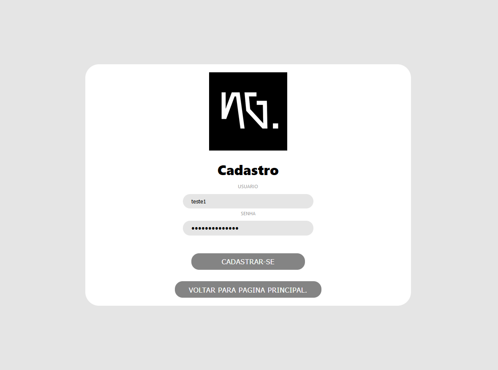
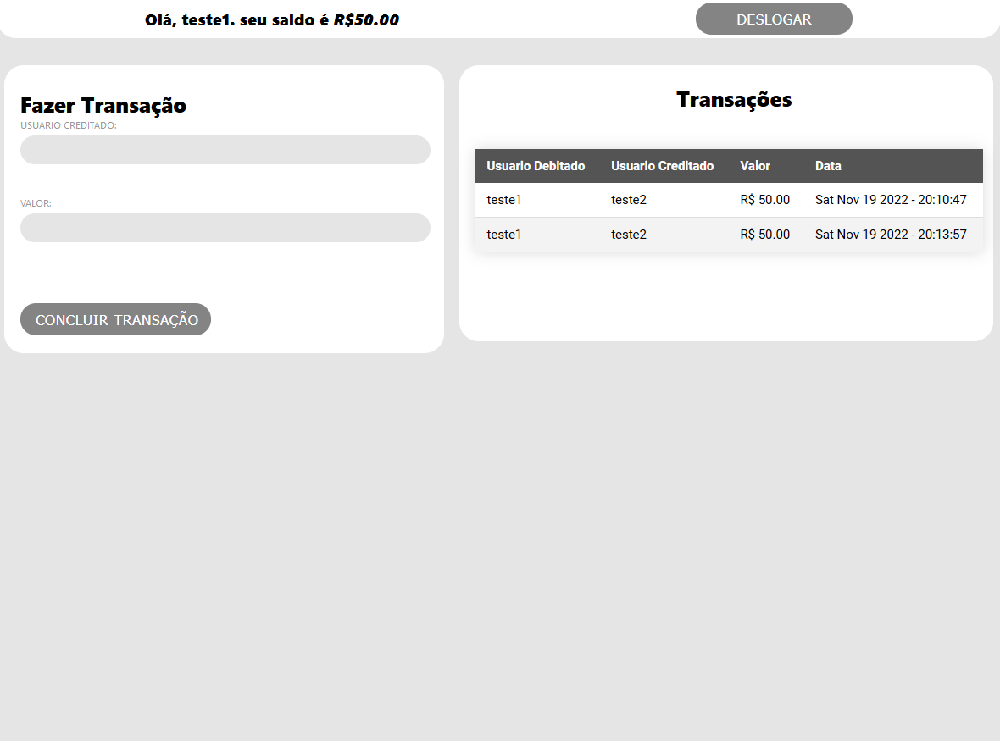

## Projeto NG.CASH - TECH CHALLENGE

Aplicação web fullstack totalmente dockerizada similar a de um banco, porem, permitindo apenas transações internas.

## 👨‍🏫 Testando:

Execute o comando a seguir na raiz do projeto:
```
docker-compose up
```

Backend ficara na porta 3333.
Frontend ficara na porta 3000.
Database ficara na porta 5432.

Ambos podem ser acessados por fora do Docker pelo localhost.

## Imagens




